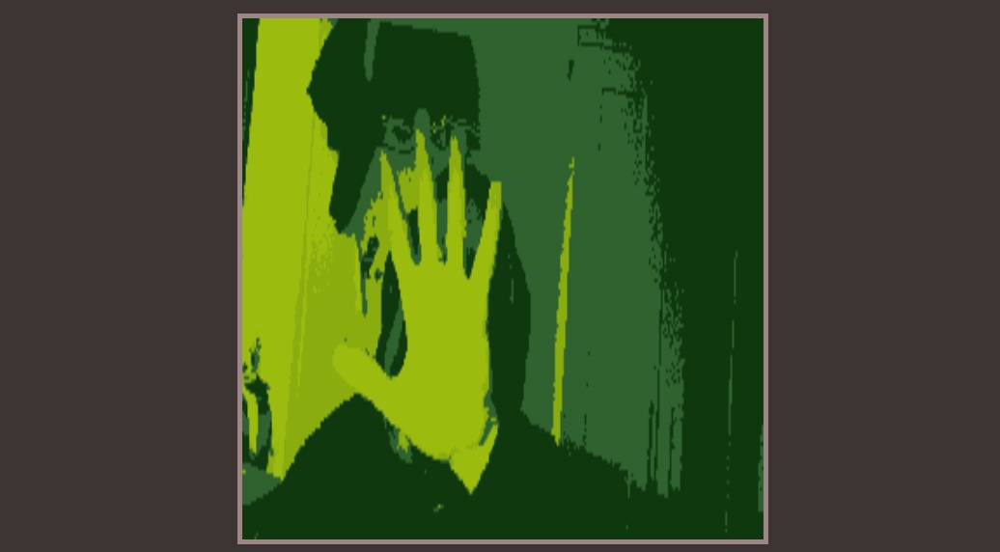

# Le Projet 404

### LE SITE

A voir ici : [Découvrez-le ici : Le projet 404](https://la404family.github.io/404/)

### Qu'est ce que le projet 404 ?

Le projet 404 est un site web collaboratif, créé par la 404 Family, qui a pour but de rassembler des petits projets en html css et javascript.

### Nos réseaux sociaux

# Bienvenue à tous !

